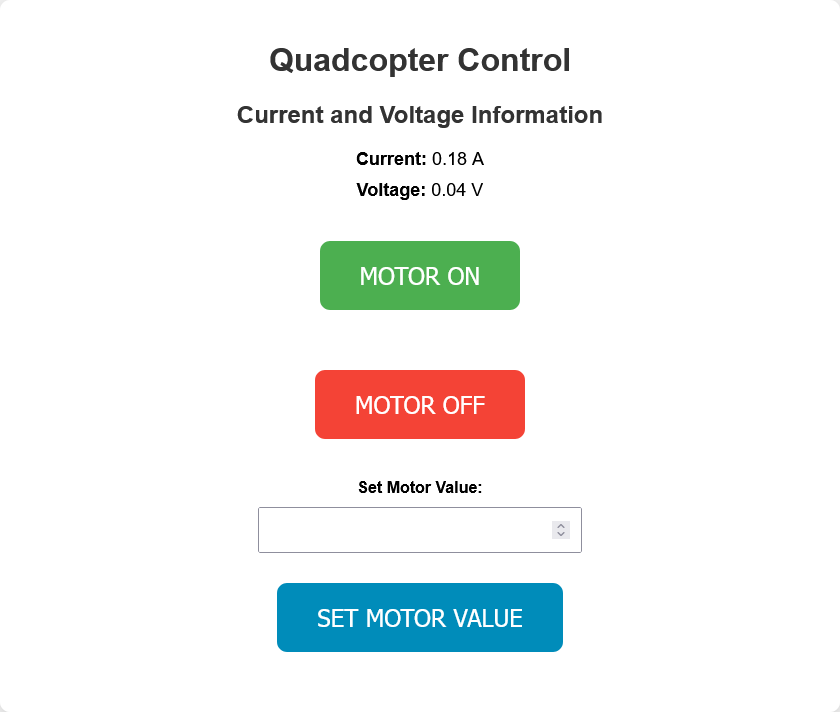
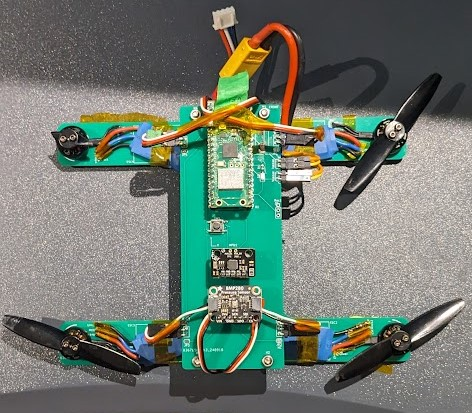

# Nano Quadcopter Project

## Overview

Welcome to the Nano Quadcopter project! This repository contains all the necessary files and instructions to build and program your own nano quadcopter.

The repository is in such a state that it would be better used as source code than an instruction manual.

This project is heavily inspired by Carbon Aeronautic's drone series [YT](https://www.youtube.com/@carbonaeronautics).

## Features

- Compact and lightweight design
- Easy to assemble
- Customizable firmware
- Open-source hardware and software

## Getting Started

### Prerequisites

- KiCad installed
- Arduino installed
- Electronics and soldering equipment

## License

This project is licensed under a standard MIT License.

## Contact

For any questions or feedback, please open an issue or contact us at [github.com.casually782@passinbox.com](mailto:github.com.casually782@passinbox.com).

Happy flying!
